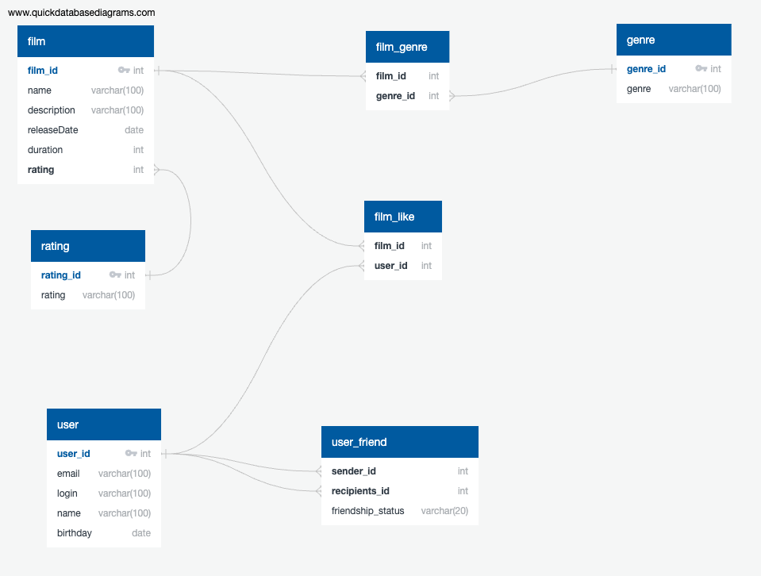

## ER-диаграмма

***
### Описание Film
**«Жанр» (англ. Genre)**. У фильма может быть сразу несколько жанров, а у поля — несколько значений. Например, таких:
+ Комедия
+ Драма
+ Мультфильм
+ Триллер
+ Документальный
+ Боевик

**Рейтинг Ассоциации кинокомпаний (англ. Motion Picture Association, сокращённо МРА)**. Эта оценка определяет возрастное ограничение для фильма. Значения могут быть следующими:
+ G — у фильма нет возрастных ограничений
+ PG — детям рекомендуется смотреть фильм с родителями
+ PG-13 — детям до 13 лет просмотр не желателен
+ R — лицам до 17 лет просматривать фильм можно только в присутствии взрослого
+ NC-17 — лицам до 18 лет просмотр запрещён


### Описание User
**Статус для связи «дружба»** между двумя пользователями:
+ _неподтверждённая_ — когда один пользователь отправил запрос на добавление другого пользователя в друзья,
+ _подтверждённая_ — когда второй пользователь согласился на добавление.

***
Пример запроса: Получение топ-10 названий фильмов по количеству лайков:
```sql
SELECT name
FROM film
WHERE film_id IN (SELECT film_id
                  FROM film_like
                  GROUP BY film_id
                  ORDER BY COUNT(user_id) DESC
                  LIMIT 10);
```
Получение друзей по id пользователя = 1:
```sql

SELECT *
FROM users AS u
WHERE u.user_id IN
    (SELECT uf.recipients_id
     FROM user_friend AS uf
     WHERE uf.sender_id = 1
       AND uf.friendship_status = 'FRIENDS')
```
